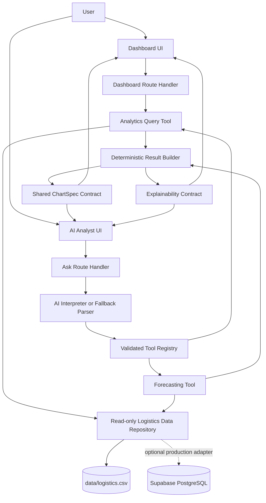
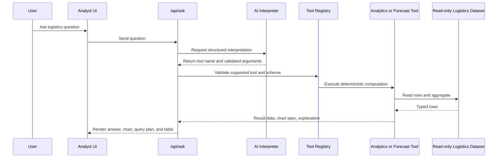

# Logistics AI Analytics Dashboard - Plan

## Goal Capsule

| Field | Decision |
|---|---|
| Objective | Build and deploy a reviewer-ready web app for a logistics client that combines a KPI dashboard, AI-orchestrated natural-language analytics, dynamic charts, explainability, demand forecasting, and read-only data access over one unified dataset, with optional Supabase/PostgreSQL runtime support for production-style deployment. |
| Primary source of truth | `mock_logistics_data (1).csv` and `data/logistics.csv` as the canonical seed/reference/runtime fallback dataset, an optional Supabase PostgreSQL `logistics_orders` runtime adapter, the assignment prompt, and the local logistics assignment files. |
| Execution profile | Greenfield full-stack app in this repo, optimized for a 6-10 hour build and a stable public deployment. |
| Authority hierarchy | Assignment requirements first; this plan second; implementation discoveries third. |
| Stop conditions | Do not commit secrets, do not execute AI-generated SQL, do not let AI answer without a computation result, and do not expose a writable production data path for this assignment. |

---

## Product Contract

### Summary

The product is a single-page logistics analytics application with two complementary surfaces: a traditional dashboard for operational KPIs and charts, and an AI analyst panel that interprets natural-language questions, routes them to deterministic analytical tools, and returns computed answers with charts and explainability.
The app uses one unified logistics order dataset and covers descriptive, diagnostic, and predictive analytics without making the AI model the source of truth.
The assignment allows the provided dataset or a database, so the canonical CSV remains a valid read-only runtime source while Supabase/PostgreSQL is supported as a production-style runtime adapter seeded from the same data.
Product Contract clarification: R23-R25 and AE6 treat Supabase/PostgreSQL as optional runtime support because the assignment requires a provided dataset or database, not a mandatory database.

### Problem Frame

The reviewer needs to see that structured operational data can be explored both through dashboard controls and through natural language.
The hard part is not just rendering charts; it is preserving data correctness while letting AI help with interpretation, tool selection, and presentation.
The plan therefore separates data loading, analytical computation, AI interpretation, chart rendering, and explanation into clear boundaries.

### Dataset Profile

The current CSV has 400 order rows across 2025, with 9 carriers, 8 product categories, 5 regions, 9 warehouses, 355 SKUs, and 47 destination cities.
Statuses include `delivered`, `delayed`, `in_transit`, `exception`, and `canceled`.
There are 30 rows without `delivery_date`, so delivery-time metrics must only use rows with a completed delivery date.
When Supabase is configured, the `logistics_orders` table must preserve the same row count, status distribution, date range, and numeric precision as the CSV seed.

### Actors

- A1. Reviewer: evaluates the public app without local setup and expects the listed assignment scenarios to work.
- A2. Logistics operations user: scans KPIs and charts, asks delivery-performance questions, and checks demand forecasts.
- A3. Developer/operator: configures environment variables, deploys the app, and verifies that secrets stay out of source control.

### Requirements

**Dashboard and Descriptive Analytics**

- R1. The app must load one read-only logistics dataset and use it consistently for dashboard KPIs, natural-language analytics, chart generation, and forecasting.
- R2. The dashboard must show total orders, delivered orders, delayed orders, on-time delivery rate, and average delivery time.
- R3. Dashboard charts must include order volume over time, delivery performance split by status, and a carrier or destination breakdown.
- R4. Dashboard filters should support at least date range, carrier, region, warehouse, and product category when those dimensions exist in the dataset.
- R5. Relative date ranges in analytical queries must resolve against the dataset's maximum `order_date`, not the real current date, because the supplied data is historical.

**Natural-Language and Diagnostic Analytics**

- R6. Users must be able to ask assignment-style questions such as delayed orders by week, highest carrier delay rate, and late orders last month.
- R7. The AI layer must convert user questions into a structured request that names intent, metric, dimension, time range, filters, grain, and desired visualization.
- R8. The analytics query tool must compute answers from validated structured inputs rather than trusting model prose.
- R9. Query responses must include a direct answer, a chart, a table or summary of underlying rows, or a combination that matches the question.
- R10. Unsupported questions must receive a clear unsupported-query response with suggested examples instead of a fabricated answer.

**Dynamic Charts and Explainability**

- R11. The system must choose chart types from a bounded chart contract and render them dynamically from computed data.
- R12. Every answer and generated chart must expose filters used, metrics, dimensions, time grain, structured interpretation, and the underlying summary data.
- R13. The UI must make the analytical provenance visible without burying the primary answer.

**Predictive and Prescriptive Analytics**

- R14. Forecasting must predict demand from historical dataset values for SKU, product category, warehouse, or total demand over a monthly horizon.
- R15. The forecasting tool must return historical values, forecast values, a chart-friendly combined series, an inventory recommendation, and a methodology explanation.
- R16. The initial forecasting method may be simple, but it must be deterministic and documented, such as moving average plus trend adjustment.

**AI Orchestration and Safety**

- R17. AI must act as router and interpreter only; all analytical answers must come from the query tool or forecasting tool.
- R18. The system must avoid raw model-generated SQL and prefer a validated analytical DSL or typed request schema.
- R19. The app must work in a degraded but usable way when the AI API key is absent by supporting a deterministic parser for the required example questions.

**Delivery and Documentation**

- R20. The app must deploy to a public URL and be usable without authentication.
- R21. Secrets must be configured through environment variables and excluded from source control.
- R22. `README.md` must document setup, environment variables, architecture, data flow, AI approach, assumptions, limitations, future improvements, repository link, and deployment URL.
- R23. The app must read logistics data through a typed repository layer that supports the canonical CSV dataset and can switch to Supabase PostgreSQL when configured, without creating divergent analytics paths.
- R24. Every runtime data path must be read-only for reviewer-facing access; if Supabase is enabled, RLS or restricted grants must allow `select` only and no user-facing insert, update, delete, or mutation route.
- R25. Supabase-backed dashboard, query, and forecasting results, when enabled, must match the CSV baseline for the canonical dataset profile and core KPI calculations.

### Acceptance Examples

- AE1. Given the user asks "Show delayed orders by week for the last 3 months", when the app interprets the query, then it returns a weekly delayed-order time series, a line or bar chart, filters showing the resolved 3-month dataset-relative window, and a table of weekly totals.
- AE2. Given the user asks "Which carrier has the highest delay rate?", when the app routes to the analytics query tool, then it returns the top carrier by delayed divided by delivered-plus-delayed orders, a ranked carrier chart, and the denominator used for each carrier.
- AE3. Given the user asks "How many orders were delivered late last month?", when the app resolves "last month" against the dataset maximum date, then it returns a computed count using `status=delayed` as the late-delivery definition and explains the date range.
- AE4. Given the user asks "Predict demand for SKU X for the next 4 months", when the SKU has enough historical data, then the app returns historical monthly demand, four forecast points, a chart, an inventory recommendation, and the forecasting method.
- AE5. Given the user asks an unsupported open-ended question, when no supported analytical intent can be validated, then the app explains the limitation and offers supported example prompts.
- AE6. Given the app is deployed with either CSV fallback or Supabase environment variables, when `/api/dashboard` and `/api/ask` run, then they load from the selected repository source, return the same canonical KPIs as the seed dataset, and expose no write capability.

### Scope Boundaries

**In Scope**

- A public, demo-quality full-stack web app with dashboard, analyst chat, chart generation, explainability, and forecasting.
- Read-only analytics over the provided logistics dataset, with CSV fallback as a valid runtime path and Supabase/PostgreSQL as an optional production-style runtime path.
- A checked-in optional database migration for `logistics_orders`, a repeatable CSV import path, and parity checks between the seed CSV and database rows when Supabase is enabled.
- A typed data repository abstraction so dashboard, AI query, and forecasting paths share the same runtime data source.
- Bounded natural-language support for the assignment examples and close variants.
- AI orchestration with deterministic validation and deterministic fallback coverage for the core prompts.

**Deferred to Follow-Up Work**

- Uploading new datasets, connecting to live logistics systems, or scheduling recurring ingestion.
- User accounts, role-based access, saved reports, and multi-tenant client separation.
- Full warehouse-style data modeling, ETL orchestration, Supabase realtime sync, or write/admin UI for order management.
- Advanced forecasting models, confidence intervals, anomaly detection, and optimization solvers.
- Full semantic SQL generation, vector search over business documentation, and conversational memory across sessions.

**Outside This Product's Identity**

- A general-purpose BI platform.
- A raw SQL workbench.
- An autonomous logistics control system that changes orders, inventory, or carrier routing.

---

## Planning Contract

### Key Technical Decisions

- KTD1. Use Next.js with TypeScript as the single deployable app surface. Next.js App Router route handlers can serve the analytics and AI endpoints in the same Vercel deployment as the UI, keeping the assignment small and easy to review.
- KTD2. Use a typed repository as the runtime data boundary. Keep `data/logistics.csv` as the canonical seed/reference and valid fallback runtime source, while supporting Supabase PostgreSQL as an optional production-style adapter seeded from the same CSV and parity-checked when enabled.
- KTD3. Define an analytical request DSL instead of model-generated SQL. The DSL names measures, dimensions, filters, time grain, sort, and limits; Zod validation rejects anything outside the supported query surface.
- KTD4. Treat OpenAI as the interpreter, not the calculator or business-response composer. The AI produces structured tool inputs; deterministic presentation code turns tool output into answers, charts, tables, and explanations.
- KTD5. Use a shared chart specification contract between backend responses and frontend rendering. The backend chooses chart type from a bounded set, and the frontend renders the same `ChartSpec` for dashboard and natural-language answers.
- KTD6. Forecast demand with a simple monthly model first. Use monthly quantity aggregates, a moving-average baseline, and an optional linear trend adjustment; this is explainable, deterministic, and enough for the assignment's forecasting requirement.
- KTD7. Make explainability a first-class response object shared by dashboard and analyst outputs. Each answer or chart carries `filters`, `metrics`, `dimensions`, `queryPlan`, `methodology`, and `sourceRows` or aggregate table previews so the reviewer can audit the result.
- KTD8. Ship with deterministic parser fallback for the required example prompts. This keeps the public app functional if an AI key is missing or rate-limited while still preserving the AI orchestration path when configured.
- KTD9. Keep every app data path read-only. The CSV path is read-only by design; when Supabase is enabled, server route handlers use `SUPABASE_URL` and `SUPABASE_ANON_KEY` against RLS-enabled tables with a `select` policy, and `SUPABASE_SERVICE_ROLE_KEY`, if used, is limited to local/CI import scripts and never exposed to the browser.
- KTD10. Do not allow model-generated SQL even when PostgreSQL is introduced. AI and fallback parsers produce validated DSL requests, and repository methods translate only whitelisted filters and dimensions into Supabase query-builder calls or deterministic in-process aggregations.
- KTD11. If Supabase is used, model the database with concrete Postgres types and constraints: `text` for labels, `date` for order/delivery dates, `integer` for quantity, `numeric` for money/percent fields, `boolean` for promotions, `order_id` as primary key, and a `status` check constraint for known statuses.

### High-Level Technical Design





### Output Structure

```text
data/
  logistics.csv
supabase/
  migrations/
    001_create_logistics_orders.sql
scripts/
  import-logistics-csv.mjs
src/
  app/
    api/
      ask/route.ts
      dashboard/route.ts
    layout.tsx
    page.tsx
    globals.css
  components/
  lib/
    ai/
    analytics/
    data/
    charts/
    presentation/
tests/
  unit/
  integration/
  e2e/
README.md
.env.example
package.json
```

### Assumptions

- The canonical app dataset will be copied from `mock_logistics_data (1).csv` into `data/logistics.csv` for predictable imports and paths.
- A Supabase project and database credentials are optional production-hardening inputs, not a prerequisite for satisfying the assignment's data requirement.
- The deployed app can read from the canonical CSV fallback or from Supabase PostgreSQL when `LOGISTICS_DATA_SOURCE=supabase` and credentials are configured; tests may use the CSV fixture or a mocked repository unless a Supabase test database is explicitly configured.
- `status=delivered` means on-time for dashboard performance, and `status=delayed` means delivered late for this assignment because the dataset has no promised-delivery/SLA date; `in_transit`, `exception`, and `canceled` count toward total orders but are excluded from the on-time-rate denominator.
- Average delivery time uses rows with both `order_date` and `delivery_date`.
- Demand means `quantity` aggregated over `order_date`, not order count or revenue, unless the user explicitly asks for order volume or value.
- The app will be public and unauthenticated for reviewer convenience.
- The deployment will configure `OPENAI_API_KEY` when AI behavior is required; local and deployed fallback behavior still supports the required examples without that key.

### Risks and Mitigations

| Risk | Impact | Mitigation |
|---|---|---|
| Ambiguous delay semantics | KPI and answer correctness can drift. | Define `status=delayed` as the late-delivery proxy in code, tests, explainability, and README. |
| AI returns unsupported or malformed tool arguments | Wrong charts or fabricated answers. | Validate with Zod, reject unsupported fields, and never compute from unvalidated model text. |
| Missing AI key in deployed environment | Reviewer might see broken natural-language flow. | Provide deterministic fallback parser for assignment examples and clear environment docs. |
| Supabase credentials missing or misconfigured while Supabase mode is forced | The optional database-backed path cannot load data. | Document `LOGISTICS_DATA_SOURCE=csv` fallback, require clear server-side configuration errors for forced Supabase mode, and run smoke checks against the selected data source. |
| Database seed drifts from CSV when Supabase is enabled | KPI results may differ from tested expectations. | Add import parity checks for row count, status counts, max date, and core KPIs before using Supabase for deployment. |
| Supabase table accidentally allows writes when database mode is enabled | Assignment requires read-only data handling. | Enable RLS, add select-only policy for app role, omit mutation routes, and reserve service role for one-off import tooling only. |
| Forecasting appears overclaimed | Reviewer may penalize simplistic prediction. | Label method as simple trend/moving average, show historical basis, and document limitations. |
| Time budget creep | Dashboard polish can consume the build window. | Land data correctness and AI/tool routing before visual refinements. |

### Sources and Research

- Assignment prompt and local files: `Coding_assignment (1).docx`, `logistics-spec (1).docx`, `logistics-spec.pdf`.
- Dataset profile from `mock_logistics_data (1).csv`.
- Next.js route handlers support request handlers in the `app` directory: [Next.js Route Handlers](https://nextjs.org/docs/app/getting-started/route-handlers).
- Vercel stores environment variables outside source and exposes them during build or function execution: [Vercel Environment Variables](https://vercel.com/docs/environment-variables).
- OpenAI function calling defines callable tools with JSON schemas and lets application code run the tool: [OpenAI Function Calling](https://platform.openai.com/docs/guides/function-calling).
- OpenAI structured outputs support JSON Schema-constrained responses, which fits the interpreter contract: [OpenAI Structured Outputs](https://platform.openai.com/docs/guides/structured-outputs).
- Supabase/PostgreSQL is an optional runtime adapter for the read-only dataset, with RLS, typed schema constraints, and environment-variable configuration documented in `README.md`; the canonical CSV fallback remains assignment-valid.

---

## Implementation Units

### U1. Project Scaffold and Runtime Baseline

- **Goal:** Create the Next.js TypeScript application foundation, install charting/test dependencies, and establish scripts that later units can rely on.
- **Requirements:** R20, R21, R22.
- **Dependencies:** None.
- **Files:** `package.json`, `package-lock.json`, `next.config.ts`, `tsconfig.json`, `eslint.config.mjs`, `postcss.config.mjs`, `src/app/layout.tsx`, `src/app/page.tsx`, `src/app/globals.css`, `.gitignore`, `.env.example`.
- **Approach:** Initialize a minimal App Router project with TypeScript, Tailwind or plain CSS modules, Recharts or an equivalent React chart library, Zod for schema validation, and a test runner suitable for unit and integration tests. Keep the first screen as the actual dashboard shell, not a marketing landing page.
- **Patterns to follow:** Follow the current Next.js App Router conventions and keep route handlers under `src/app/api`.
- **Test scenarios:** Test expectation: none for product behavior in this unit because it is scaffold-only; later units add behavior tests.
- **Verification:** The app boots locally, renders a non-empty dashboard shell, ignores local env files, and has documented scripts for lint, unit tests, e2e tests, and production build.

### U2. CSV Seed Module and Domain Model

- **Goal:** Normalize the provided CSV into typed logistics order rows with derived fields used by seed import, parity checks, tests, and local fallback paths.
- **Requirements:** R1, R5, R14, R18.
- **Dependencies:** U1.
- **Files:** `data/logistics.csv`, `src/lib/data/logisticsSchema.ts`, `src/lib/data/loadLogisticsData.ts`, `src/lib/data/dateMath.ts`, `tests/unit/data/logisticsData.test.ts`.
- **Approach:** Copy the provided CSV into `data/logistics.csv`, parse it server-side, validate required columns, coerce numeric/date fields, derive `deliveryDays`, `orderWeek`, `orderMonth`, `isClosedDelivery`, and expose dataset metadata such as maximum order date. Treat parse errors as developer-visible failures rather than silently dropping rows.
- **Execution note:** Start with fixture-level tests that lock the current dataset shape before building higher-level analytics.
- **Patterns to follow:** Keep all file paths repo-relative and isolate filesystem reads to the server-side data module.
- **Test scenarios:** 
  - Loading the canonical CSV returns 400 rows with the expected column names.
  - Rows with empty `delivery_date` parse successfully and have `deliveryDays=null`.
  - Numeric fields such as `quantity`, `unit_price_usd`, and `order_value_usd` are numbers, not strings.
  - Dataset metadata returns maximum `order_date=2025-12-30` for relative-date resolution.
  - Status counts match the current dataset profile for `delivered`, `delayed`, `in_transit`, `exception`, and `canceled`.
- **Verification:** CSV parsing is centralized, deterministic, and reusable by the Supabase import/parity milestone while remaining a valid read-only runtime fallback.

### U2A. Optional Supabase PostgreSQL Schema and Import Path

- **Goal:** Add the optional PostgreSQL data layer for production-style deployment while preserving the provided dataset as the read-only, auditable source of truth.
- **Requirements:** R1, R21, R23, R24, R25, AE6.
- **Dependencies:** U2.
- **Files:** `supabase/migrations/001_create_logistics_orders.sql`, `scripts/import-logistics-csv.mjs`, `src/lib/data/logisticsSchema.ts`, `.env.example`, `README.md`, `tests/unit/data/supabaseSchema.test.ts`, `tests/unit/data/importLogisticsCsv.test.ts`.
- **Approach:** Create a `public.logistics_orders` table with one row per order. Use `order_id text primary key`, `date` columns for `order_date` and `delivery_date`, `integer` for `quantity`, `numeric` for money and discount values, `boolean` for `is_promo`, and `text` for labels/dimensions. Add a `status` check constraint for `delivered`, `delayed`, `in_transit`, `exception`, and `canceled`. Add minimal indexes for known filter paths, starting with `order_date`, `status`, and common dashboard filters only if query shape justifies them. Enable RLS and add a select-only policy for the app role; do not add insert/update/delete policies for reviewer-facing access.
- **Execution note:** Use the service role only for a local/CI import command if needed; never expose it to client code or route responses.
- **Patterns to follow:** Keep identifiers lowercase snake_case, use explicit Postgres types, avoid `ADD CONSTRAINT IF NOT EXISTS`, and keep migrations repeatable in local/dev environments.
- **Test scenarios:**
  - Migration text creates `public.logistics_orders` with `order_id` primary key and typed columns matching the CSV schema.
  - Migration enables RLS and includes a select-only policy for application access.
  - Import dry-run parses all 400 CSV rows and maps empty `delivery_date` to `null`.
  - Import parity checks validate row count, status counts, maximum `order_date=2025-12-30`, and representative money/quantity values.
  - `.env.example` documents `SUPABASE_URL`, `SUPABASE_ANON_KEY`, optional import-only `SUPABASE_SERVICE_ROLE_KEY`, and `OPENAI_API_KEY` without values.
- **Verification:** A fresh Supabase database can receive the migration and seed import, then report the same canonical dataset profile as `data/logistics.csv`.

### U2B. Repository Source Selection and Supabase Adapter

- **Goal:** Route dashboard, natural-language analytics, and forecasting through one typed data repository that uses the canonical CSV fallback by default and Supabase when explicitly configured.
- **Requirements:** R1, R5, R8, R18, R23, R24, R25, AE1, AE2, AE3, AE4, AE6.
- **Dependencies:** U2, with U2A required only for the Supabase-backed adapter path.
- **Files:** `src/lib/data/logisticsRepository.ts`, `src/lib/data/supabaseLogisticsRepository.ts`, `src/lib/data/csvLogisticsRepository.ts`, `src/lib/data/logistics.ts`, `src/app/api/dashboard/route.ts`, `src/app/api/ask/route.ts`, `tests/unit/data/logisticsRepository.test.ts`, `tests/integration/api/dashboard.test.ts`, `tests/integration/api/ask.test.ts`.
- **Approach:** Define a repository contract for reading rows and dataset metadata with whitelisted filters only. Implement a Supabase adapter using `@supabase/supabase-js` server-side calls with `SUPABASE_URL` and `SUPABASE_ANON_KEY`; keep all analytics computation in deterministic TypeScript unless a future optimized SQL path is explicitly added and tested. Keep the CSV adapter as a test fixture/fallback path and make data source selection explicit via environment configuration.
- **Execution note:** The AI interpreter must never see database credentials, SQL strings, or raw table access; it only produces validated DSL inputs consumed by the tool registry.
- **Patterns to follow:** Prefer parameterized/structured Supabase query builder calls, map database rows into the existing domain model at the repository boundary, and expose clear errors when Supabase env vars are absent only when Supabase mode is explicitly selected.
- **Test scenarios:**
  - Repository contract tests pass against the CSV adapter and a mocked Supabase adapter.
  - Dashboard and ask route handlers depend on the repository contract rather than direct CSV reads.
  - Missing Supabase environment variables produce a clear server-side configuration error only when `LOGISTICS_DATA_SOURCE=supabase` is explicitly selected.
  - Supabase adapter applies only whitelisted filters and rejects unsupported filter keys before querying.
  - Core KPIs and assignment example answers match the CSV baseline when the mocked Supabase rows mirror `data/logistics.csv`.
- **Verification:** Production routes have one data path through the repository, and the deployed build can use either CSV fallback or Supabase without code changes.

### U3. Analytics Query Tool and Dashboard Aggregations

- **Goal:** Implement deterministic KPI, grouping, filtering, sorting, and top-N calculations for dashboard and natural-language queries.
- **Requirements:** R2, R3, R4, R5, R6, R8, R9, R12, AE1, AE2, AE3.
- **Dependencies:** U2B.
- **Files:** `src/lib/analytics/analyticsTypes.ts`, `src/lib/analytics/filterRows.ts`, `src/lib/analytics/queryTool.ts`, `src/lib/analytics/dashboardMetrics.ts`, `src/lib/analytics/metricDefinitions.ts`, `tests/unit/analytics/queryTool.test.ts`, `tests/unit/analytics/dashboardMetrics.test.ts`.
- **Approach:** Define supported measures such as `order_count`, `delayed_order_count`, `delivered_order_count`, `on_time_rate`, `average_delivery_days`, `quantity`, and `order_value_usd`. Define dimensions such as `order_week`, `order_month`, `carrier`, `destination_city`, `region`, `warehouse`, `product_category`, and `sku`. Build one query engine over repository-returned rows that applies validated filters, groups rows, calculates metrics, sorts results, and returns both result rows and explanation metadata. Keep this as deterministic computation over validated data, not model prose or generated SQL.
- **Execution note:** Implement behavior test-first for the assignment example queries because they are the highest-value reviewer paths.
- **Patterns to follow:** Keep business metric definitions in `metricDefinitions.ts` so dashboard cards and AI answers cannot drift.
- **Test scenarios:** 
  - Dashboard KPIs calculate total orders, delivered orders, delayed orders, on-time rate, and average delivery time from repository-returned canonical data.
  - A last-3-month delayed-by-week query resolves against the dataset maximum date and returns weekly groups only within that window.
  - Highest delay-rate by carrier uses delayed divided by delivered-plus-delayed orders and excludes non-terminal statuses from the denominator.
  - "Delivered late last month" resolves to rows with `status=delayed` in the previous dataset-relative month.
  - Filtering by carrier and region narrows all metrics and grouped rows consistently.
  - Empty result sets return zero metrics and an explanatory empty state instead of throwing.
  - Invalid measures, dimensions, or filters are rejected before computation.
- **Verification:** The dashboard API and AI query path both call this tool for overlapping metrics, and results remain source-equivalent when the repository is backed by Supabase or the CSV fixture.

### U4. Forecasting Tool and Inventory Recommendation

- **Goal:** Implement deterministic demand forecasting over the historical dataset and return chart-ready historical-plus-forecast series.
- **Requirements:** R14, R15, R16, R17, AE4.
- **Dependencies:** U2B, U3.
- **Files:** `src/lib/analytics/forecastTool.ts`, `src/lib/analytics/forecastTypes.ts`, `tests/unit/analytics/forecastTool.test.ts`.
- **Approach:** Aggregate demand as monthly `quantity` by requested entity from repository-returned historical rows. Support forecast dimensions for total demand, `sku`, `product_category`, and `warehouse`. Use a moving average baseline with simple trend adjustment when enough monthly observations exist; fall back to moving average when the series is sparse. Recommend inventory as next-period forecast plus configurable safety stock based on recent volatility.
- **Patterns to follow:** Reuse `filterRows.ts` and date utilities from U3 instead of creating a second filtering path.
- **Test scenarios:** 
  - Forecasting total demand for four months returns historical points through the last dataset month and exactly four future points.
  - Forecasting a known SKU with sparse history returns a clear low-confidence methodology note and does not produce negative demand.
  - Product-category forecasting filters rows before monthly aggregation.
  - Inventory recommendation increases when recent demand volatility is higher.
  - Invalid horizons and unsupported forecast dimensions are rejected with user-safe errors.
- **Verification:** Forecast responses include values, chart spec inputs, inventory recommendation, and methodology text without calling the AI model for calculations.

### U5. AI Interpreter, Tool Registry, and Ask API

- **Goal:** Route natural-language questions through a validated AI-or-fallback interpretation layer and execute the selected analytical tool.
- **Requirements:** R6, R7, R8, R9, R10, R17, R18, R19, AE1, AE2, AE3, AE4, AE5.
- **Dependencies:** U3, U4.
- **Files:** `src/lib/ai/interpreterSchema.ts`, `src/lib/ai/openAiInterpreter.ts`, `src/lib/ai/fallbackInterpreter.ts`, `src/lib/ai/toolRegistry.ts`, `src/lib/presentation/answerComposer.ts`, `src/app/api/ask/route.ts`, `tests/unit/ai/fallbackInterpreter.test.ts`, `tests/integration/api/ask.test.ts`.
- **Approach:** Define a strict interpreter schema with allowed `toolName` values of `analytics_query`, `forecast_demand`, and `unsupported`. When `OPENAI_API_KEY` exists, request structured model output constrained to that schema. When it does not, use deterministic pattern matching for the assignment examples. The route handler validates output, executes exactly one supported tool, then calls non-AI presentation code to compose an answer grounded in returned data.
- **Execution note:** Mock the OpenAI client in tests; do not require live API calls for verification.
- **Patterns to follow:** Keep the route handler thin; interpreter, registry, and answer composition should be plain TypeScript modules with direct tests.
- **Test scenarios:** 
  - The delayed-by-week prompt maps to `analytics_query` with metric, weekly grain, and last-3-month filter.
  - The highest-delay-rate prompt maps to `analytics_query` grouped by carrier and sorted descending.
  - The forecast prompt maps to `forecast_demand` with entity and horizon arguments.
  - Malformed AI output is rejected and returns a safe unsupported response.
  - With no `OPENAI_API_KEY`, required example prompts still produce computed answers via fallback.
  - The API never returns an answer when tool execution fails validation.
- **Verification:** API responses include `answer`, `chart`, `explanation`, `table`, and `unsupportedReason` only when applicable.

### U6. Shared Chart Contract and Renderer

- **Goal:** Render dashboard and AI-generated charts from a common chart specification.
- **Requirements:** R3, R9, R11, R12, AE1, AE2, AE4.
- **Dependencies:** U3, U4.
- **Files:** `src/lib/charts/chartSpec.ts`, `src/lib/charts/selectChartType.ts`, `src/components/ChartRenderer.tsx`, `src/components/ChartPanel.tsx`, `tests/unit/charts/selectChartType.test.ts`, `tests/unit/charts/chartSpec.test.ts`.
- **Approach:** Support a bounded chart set: line for time series, bar for ranked categories, stacked or grouped bar for status comparisons, and simple table fallback when a chart would mislead. Use consistent field names, labels, units, and empty states. Keep chart colors restrained and use legends when a grouping dimension is encoded.
- **Patterns to follow:** Let backend responses carry chart intent while frontend owns rendering details.
- **Test scenarios:** 
  - Time-grain queries select a line or bar time-series chart with the date field on the x-axis.
  - Carrier delay-rate rankings select a horizontal or vertical bar chart sorted by rate.
  - Delivered-versus-delayed comparisons include both status labels in the legend.
  - Sparse or unsupported chart shapes return a table fallback spec rather than throwing.
  - Chart specs include enough labels and units for accessible rendering.
- **Verification:** Dashboard charts and AI answer charts use the same renderer and do not duplicate chart-specific transformation logic.

### U7. Dashboard UI

- **Goal:** Build the main analytics dashboard with KPI cards, filters, chart panels, shared explainability, and responsive layout for reviewer use.
- **Requirements:** R2, R3, R4, R12, R13, R20.
- **Dependencies:** U3, U6.
- **Files:** `src/app/api/dashboard/route.ts`, `src/app/page.tsx`, `src/components/DashboardApp.tsx`, `src/components/ChartRenderer.tsx`, `tests/integration/api/dashboard.test.ts`, `tests/e2e/dashboard.spec.ts`.
- **Approach:** Load dashboard summary data from `/api/dashboard`, render five KPI cards, and render all three dashboard chart families: order volume over time, delivery performance split by status, and carrier or destination breakdown. Provide filter controls for date range, carrier, region, warehouse, and category where practical, and expose the same filter/metric/dimension provenance used by analyst answers.
- **Patterns to follow:** The first viewport should be the usable dashboard, not a hero or marketing page.
- **Test scenarios:** 
  - Dashboard API returns all five minimum KPIs plus chart specs for order volume over time, delivery performance, and carrier or destination breakdown.
  - The page renders KPI cards and all three dashboard chart families on desktop and mobile widths.
  - Each dashboard chart exposes filters, metrics, dimensions, and source summary data through the shared explainability surface.
  - Applying a carrier filter updates KPI values and chart data consistently.
  - Missing or empty chart data renders a polished empty state.
  - The dashboard remains usable without authentication.
- **Verification:** A reviewer can load the deployed URL and immediately inspect operational performance without entering a prompt.

### U8. AI Analyst UI and Explainability Surface

- **Goal:** Build the natural-language interface with example prompts, answer cards, dynamic charts, query-plan explanation, and underlying data table.
- **Requirements:** R6, R9, R10, R12, R13, R19, AE1, AE2, AE3, AE4, AE5.
- **Dependencies:** U5, U6.
- **Files:** `src/components/DashboardApp.tsx`, `src/components/ChartRenderer.tsx`, `src/components/assistant/AnalystPanel.tsx`, `src/components/assistant/QuestionInput.tsx`, `src/components/assistant/ExamplePrompts.tsx`, `src/components/assistant/AnswerCard.tsx`, `src/components/explainability/ExplainabilityPanel.tsx`, `src/components/explainability/UnderlyingDataTable.tsx`, `tests/e2e/assistant.spec.ts`.
- **Approach:** Place the AI analyst beside or below the dashboard depending on viewport. Include the required example prompts as clickable starting points. Render the direct answer first, chart second, and explainability/table details in a compact expandable or tabbed area.
- **Patterns to follow:** Do not use visible instructional copy to explain every UI feature; use clear labels, example prompts, and discoverable panels.
- **Test scenarios:** 
  - Clicking each required example prompt returns a non-empty computed answer.
  - The delayed-by-week answer displays filters, metric, dimension, query plan, chart, and table.
  - The highest-delay-rate answer identifies a carrier and shows the ranked basis.
  - The forecast answer shows historical and forecast values plus methodology.
  - Unsupported prompts render a helpful limitation message and suggested examples.
  - Long answer text and table contents do not overlap on mobile widths.
- **Verification:** The analyst panel demonstrates diagnostic and predictive workflows without requiring the reviewer to know exact prompt syntax.

### U9. README, Deployment, and Submission Readiness

- **Goal:** Document and deploy the application so reviewers can evaluate it through a repository link and public URL, with CSV fallback and optional Supabase configuration both explained.
- **Requirements:** R20, R21, R22, R23, R24, R25.
- **Dependencies:** U1, U2, U2B, U7, U8, with U2A required only when the selected deployment uses Supabase.
- **Files:** `README.md`, `.env.example`, `vercel.json`, `tests/e2e/smoke.spec.ts`.
- **Approach:** Write README sections for setup, CSV fallback, optional Supabase migration/import, environment variables, architecture, data flow, AI approach, assumptions, limitations, future improvements, deployment URL, and test credentials if auth is ever added. Deploy to Vercel using one explicit read-only data source, configure `OPENAI_API_KEY` when available, configure Supabase variables only when the database adapter is selected, and verify the public URL after deployment.
- **Execution note:** Treat deployment smoke verification as part of the feature, not an afterthought.
- **Patterns to follow:** Keep secrets out of README and source; document variable names only.
- **Test scenarios:** 
  - README setup instructions let a fresh developer run the app locally from CSV fallback and optionally with Supabase configured, with or without `OPENAI_API_KEY`.
  - `.env.example` names required and optional variables without secret values.
  - Production build succeeds.
  - Public deployment loads dashboard from the selected repository source with all three chart families and supports at least one analyst prompt.
  - A deployed-like smoke run with `OPENAI_API_KEY` absent still answers the required example prompts through fallback parsing.
  - Supabase parity verification confirms deployed runtime data matches the CSV seed profile before final submission when Supabase is selected.
  - README limitations match actual unsupported query behavior.
- **Verification:** Final submission includes repository URL, live deployment URL, and no authentication requirement.

---

## Verification Contract

| Gate | Scope | Expected Done Signal |
|---|---|---|
| Type and lint checks | Whole app | TypeScript and lint pass with no ignored product errors. |
| Unit tests | U2, U2A, U2B, U3, U4, U5, U6 | Data parsing, schema/import checks, repository contracts, metrics, query routing, forecasting, and chart selection tests pass. |
| API integration tests | U2B, U5, U7 | `/api/ask` and `/api/dashboard` return validated response shapes, shared explainability metadata, and matching results for an equivalent dashboard and analyst query through the repository layer. |
| Source parity check | U2, U2A, U2B, U9 | CSV dataset profile is locked; when Supabase is enabled, PostgreSQL row count, status counts, max date, and core KPIs match `data/logistics.csv`, and the app role has select-only access. |
| E2E smoke tests | U7, U8, U9 | Dashboard loads, all three chart families render, required example prompts work, fallback works without `OPENAI_API_KEY`, and mobile layout has no overlapping primary content. |
| Production build | U1-U9 | The app builds for deployment with no committed secrets. |
| Deployed smoke check | U9 | Public URL loads from the selected read-only data source and core dashboard plus analyst scenarios work without local setup. |

---

## Definition of Done

- The repository contains a working full-stack app, the canonical CSV seed, optional Supabase migration/import path, tests, README, and deployment configuration.
- The deployed runtime uses one selected read-only data source through the repository layer; if Supabase PostgreSQL is selected, it is protected as read-only for application access and parity-checked against the seed dataset.
- The dashboard displays all required KPIs plus order volume over time, delivery performance, and carrier or destination breakdown using the shared analytics layer.
- The natural-language interface handles the assignment example prompts through AI orchestration or deterministic fallback and never fabricates answers without tool computation.
- Every analyst answer and dashboard chart includes filters, metrics, dimensions, structured interpretation, and underlying summary data.
- Forecasting returns historical data, forecast values, visualization-ready output, an inventory recommendation, and methodology explanation.
- The public deployment URL is stable, unauthenticated, and documented in `README.md`.
- No secrets are committed, and `.env.example` documents optional OpenAI and Supabase configuration.
- Abandoned experimental code and unused generated artifacts are removed before final submission.
